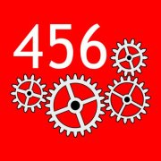
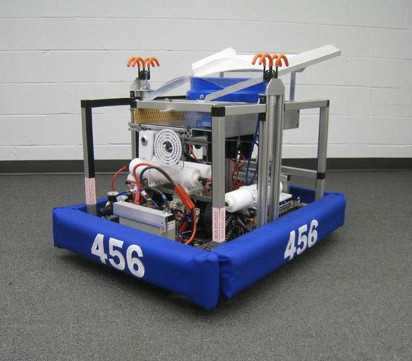

FRC Team 456, Siege Robotics 
============
CoProcessor Vision Code 2013
=================================

Summary
-------

This repository's initial main branch contains the vision processing
code used by FRC Team 456 for the 2013 competition season.  The code
was compiled and executed on a Pandaboard runing Ubuntu, OpenCV, and target coordinates communicated
to the LabView CRIO via the HTTP `get` command.

Awards
------
* Innovation in Control Award, Bayou Regional, 2013
* Innovation in Control Award, Razorback Regional, 2013

